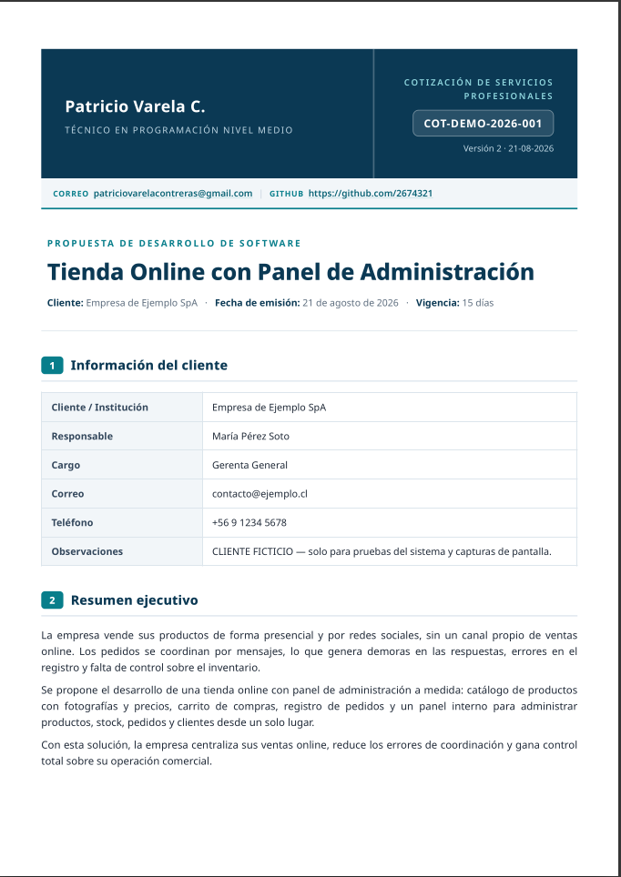

Coquimbo, Chile 🇨🇱

**CA2OPX** · **Bomb. OP.** · **Operador RPAS** · **D.C V.M**

Desarrollo soluciones digitales para **salud pública, emergencias y gestión institucional**:
sistemas operativos de bomberos, Defensa Civil y atención
primaria de salud.

## Tecnologías

- **Google Apps Script + clasp**: sistemas de gestión sobre Google Workspace (Sheets como base de datos, UI web propia, PDFs, dashboards)
- **IA generativa (Gemini API)**: análisis y calidad de datos, detección de inconsistencias, duplicados, integridad, corrección asistida y auditoría dentro de sistemas funcionales
- **PWA offline-first**: aplicaciones de terreno que funcionan sin conexión
- **CI con GitHub Actions**: verificación automática de sintaxis y pruebas

## IA & Automatización

Estoy incorporando **IA generativa de forma práctica dentro de sistemas
funcionales**, como extensión de aplicaciones que ya operan en producción sobre
Google Workspace.

En el sistema **ECICEP** (`Google Apps Script + Google Sheets`) integro la
**API de Gemini** para tareas de análisis, validación y calidad de datos:

- **Análisis de calidad de datos**: detección de inconsistencias de formato,
  campos vacíos y patrones sobre la estructura de las hojas.
- **Validación local**: detección de duplicados y verificación de integridad de
  eventos ejecutadas en memoria, **sin enviar registros identificables a la API**.
- **Corrección asistida**: normalización de RUT, fechas, nombres, teléfonos y
  sexo reutilizando validadores deterministas, con registro trazable en `LOG_IA`.
- **Automatización y auditoría**: retry/backoff ante límites del proveedor,
  configuración por Script Properties y registro de cada modificación para
  revisión.
- **Privacidad por diseño**: API key fuera del código fuente y minimización de
  datos (estructura, estadísticas y patrones en lugar de datos personales).

Trabajo real en producción: la IA actúa como **asistencia técnica de validación
y calidad de datos**, no como autoridad clínica ni sustitución de criterio
profesional. Detalle técnico de esta integración en
[`docs/INFORME_IA_GEMINI.md`](https://github.com/2674321/Sistema-Gestion-Sectores-ECICEP/blob/master/docs/INFORME_IA_GEMINI.md).

## Visión

<table>
<tr>
<td align="center" width="50%">

 PADI · Seguimiento Clínico
</td>
<td align="center" width="50%">

 Carro de Paro · Inventario
</td>
</tr>
<tr>
<td align="center" width="50%">

 Guardias · Calendarización
</td>
<td align="center" width="50%">

 Cotizaciones · PDF
</td>
</tr>
</table>

## Proyectos

### En uso 🟢

| Proyecto | Descripción |
|----------|-------------|
| **[Sistema · Gestión de Guardias](https://github.com/2674321/sistema-de-guardias)** | Calendarización y gestión de guardias para la 1ª Compañía de Bomberos del CBC (Coquimbo): niveles Inicial/Operativo/Profesional con cupos por día, asistencia, baja protegida con código enviado al correo y panel de administración integrado sobre Google Sheets. |
| **[Sistema · Cotizaciones PDF](https://github.com/2674321/sistema-cotizaciones)** | Generador personal de cotizaciones profesionales para servicios tecnológicos: JSON → plantilla HTML → PDF con WeasyPrint, QR de verificación + hash SHA-256 anti-alteraciones, desglose justificado de la inversión y numeración automática. |
| **[Sistema · Seguimiento Clínico PADI](https://github.com/2674321/cesfam-san-juan-padds)** | Sistema de seguimiento clínico desarrollado a solicitud del Servicio PADI (Coquimbo): registro de pacientes con dependencia, cuidador principal, controles y patologías crónicas, alertas de vigencia y agenda. |
| **[Sistema · Control de Carro de Paro](https://github.com/2674321/carro-de-paro)** | Revisión de inventario de carros de paro (urgencia ambulatoria y móviles): medicamentos e insumos, revisiones periódicas, stock y vencimientos. |
| **[Sistema ECICEP](https://github.com/2674321/sistema-gestion-sectores-ecicep)** | Sistema personal de registro y gestión clínica de pacientes: formulario web único de captura, identificación y deduplicación, modelo de estratificación por sectores (naranjo/amarillo/verde), panel de control, estadísticas REM (Excel/PDF), cola de calidad y backups — Google Sheets + Apps Script · **[IA](https://github.com/2674321/Sistema-Gestion-Sectores-ECICEP/blob/master/docs/INFORME_IA_GEMINI.md)**: integración de la API de Gemini con análisis y calidad de datos, validación local de duplicados e integridad, corrección asistida y auditoría trazable · 🧪 [demo del formulario](https://2674321.github.io/Sistema-Gestion-Sectores-ECICEP/) |
| **[Manual · Guía de Radiocomunicaciones](https://github.com/2674321/guia-radiocomunicaciones-ca2opx)** | Manual de campo imprimible (A4) con los códigos de radio usados en emergencias en Chile — Código Q (UIT), Claves R (CONAF) y alfabeto fonético OACI — en dos versiones: Claves 10 del Cuerpo de Bomberos de Coquimbo y Códigos 10 de Banda Ciudadana (CB). Incluye tarjetas con QR listas para imprimir · 🌐 [ver online](https://2674321.github.io/guia-radiocomunicaciones-ca2opx/) |

### En desarrollo 🚧

| Proyecto | Descripción |
|----------|-------------|
| **[Sistema · Base de Datos Defensa Civil](https://github.com/2674321/base-datos-defensa-civil)** | Sistema integral para la Defensa Civil de Chile, Sede La Serena: voluntarios con grados y especialidades, eventos, entregas de equipamiento e inventario, con dashboard y control de acceso. |

### Formación / Proyectos antiguos

| Proyecto | Descripción |
|----------|-------------|
| **[App offline · Asistencia Digital Bomberos](https://github.com/2674321/asistencia-digital-bomberos)** | Propuesta de digitalización del registro de asistencia de voluntarios de la 1ª Compañía de Bomberos de Coquimbo. Descontinuada: exige el formato institucional exacto, pendiente de replicar digitalmente · ▶️ [demo](https://2674321.github.io/asistencia-digital-bomberos/) |
| **[Programa escritorio · Seguimiento de Baterías](https://github.com/2674321/seguimiento-baterias-pernostock-ltda)** | Aplicación de escritorio en Ruby/GTK3 + SQLite desarrollada para Pernostock Ltda: registro, búsqueda, historial, estadísticas y copias de seguridad de baterías. |
| **[Página web · Aurea Salud](https://github.com/2674321/pagina-web-aurea-salud)** | Prototipo experimental de plataforma de salud/telemedicina: landing informativa, login simulado y panel administrativo estático. Incompleto por diseño; conservado como referencia de aprendizaje. |

## 📮 Contacto

- 📻 **CA2OPX** · Coquimbo
- 🎓 ORCID: [0009-0002-1087-9445](https://orcid.org/0009-0002-1087-9445)
- 🇨🇱 Chile
