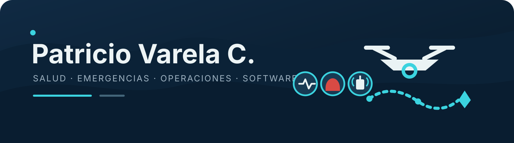
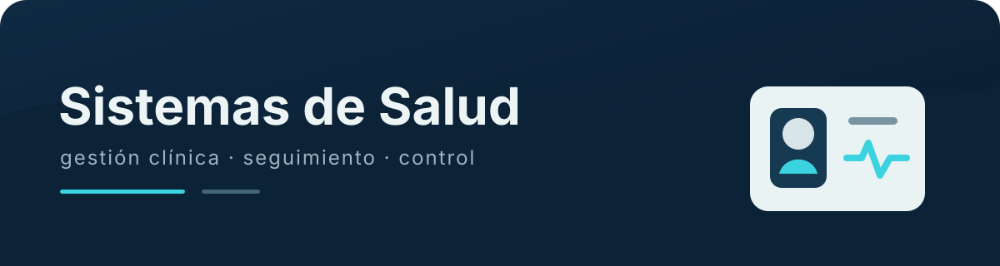
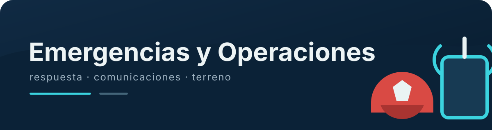
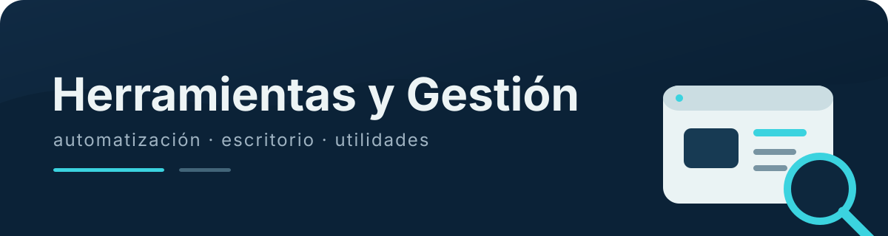

  

# Patricio Varela C.

**Coquimbo, Chile 🇨🇱** · **CA2OPX** · **Bombero Operativo** · **Operador RPAS** · **Voluntario Mayor, Defensa Civil**

Desarrollo soluciones digitales orientadas a **salud pública, emergencias, gestión institucional y operaciones de terreno**. Mi enfoque es transformar procesos manuales, planillas y registros dispersos en sistemas simples, trazables y mantenibles.

## Tecnologías

Trabajo principalmente con **Google Apps Script + Sheets**, aplicaciones web en **JavaScript/TypeScript**, sistemas locales en **Python + SQLite** y utilidades de escritorio en **Ruby/GTK3**. Priorizo pruebas, validaciones, trazabilidad, respaldos y una interfaz clara para el usuario final.

  

<table>
<tr>
<td align="center" width="50%">
 
<b>ECICEP</b> 
Gestión clínica, sectorización, seguimiento, REM y calidad de datos.
</td>
<td align="center" width="50%">
 
<b>Seguimiento Clínico PADI</b> 
Pacientes, controles, vigencias, agenda y seguimiento clínico.
</td>
</tr>
<tr>
<td align="center">
 
<b>Control de Carro de Paro</b> 
Stock, revisiones, vencimientos e informes para SAPU y móviles.
</td>
<td align="center">
 
<b>Aurea Salud</b> 
Prototipo formativo de plataforma de salud y telemedicina.
</td>
</tr>
</table>

  

<table>
<tr>
<td align="center" width="50%">
 
<b>Sistema de Guardias</b> 
Calendarización, cupos, asistencia y control operativo para Bomberos.
</td>
<td align="center" width="50%">
 
<b>Defensa Civil</b> 
Voluntarios, eventos, entregas, inventario y trazabilidad.
</td>
</tr>
<tr>
<td align="center">
 
<b>Asistencia Digital Bomberos</b> 
PWA histórica para registro y sincronización de asistencia.
</td>
<td align="center">
 
<b>Guía de Radiocomunicaciones</b> 
Referencia web e imprimible para comunicaciones de campo.
</td>
</tr>
<tr>
<td align="center" colspan="2">
 
<b>VantOPS Chile</b> 
Planificación, meteorología y bitácora para operaciones RPAS.
</td>
</tr>
</table>

  

<table>
<tr>
<td align="center" width="50%">
 
<b>Sistema de Cotizaciones</b> 
Documentos PDF, QR de verificación y desglose técnico de costos.
</td>
<td align="center" width="50%">
 
<b>PernoLabel</b> 
Etiquetas Code128 y QR desde XLSX, XLS, ODS o CSV.
</td>
</tr>
<tr>
<td align="center">
 
<b>Seguimiento de Baterías</b> 
Aplicación de escritorio para historial, stock y trazabilidad.
</td>
<td align="center">
 
<b>GitHub Repository Auditor</b> 
CLI reproducible para inventario y auditoría de repositorios.
</td>
</tr>
<tr>
<td align="center" colspan="2">
 
<b>PernoStock Web</b> 
Primer proyecto web del portfolio, conservado como referencia histórica.
</td>
</tr>
</table>

## Principios de trabajo

**Separación de datos, lógica y presentación · validaciones comprensibles · trazabilidad · pruebas de regresión · respaldos · documentación operativa · interfaces sobrias orientadas a tareas concretas.**

El catálogo histórico y la convención local de proyectos se mantienen en [PROJECT_CATALOG.md](PROJECT_CATALOG.md). Las reglas comunes de seguridad, visibilidad, estados y flujo de cambios están en [PORTFOLIO_GOVERNANCE.md](PORTFOLIO_GOVERNANCE.md).

## Contacto

**CA2OPX** · Coquimbo, Chile 🇨🇱  
**ORCID:** [0009-0002-1087-9445](https://orcid.org/0009-0002-1087-9445)
