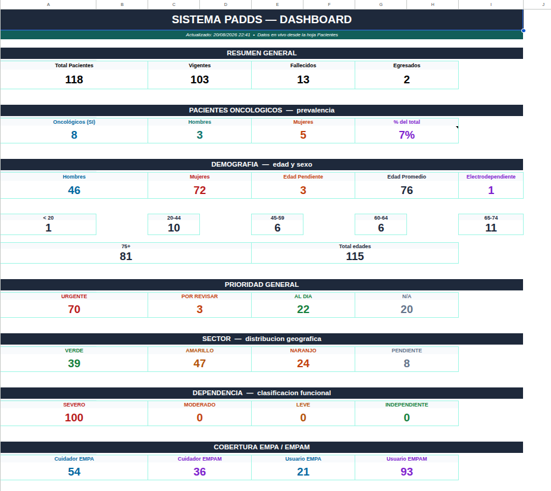
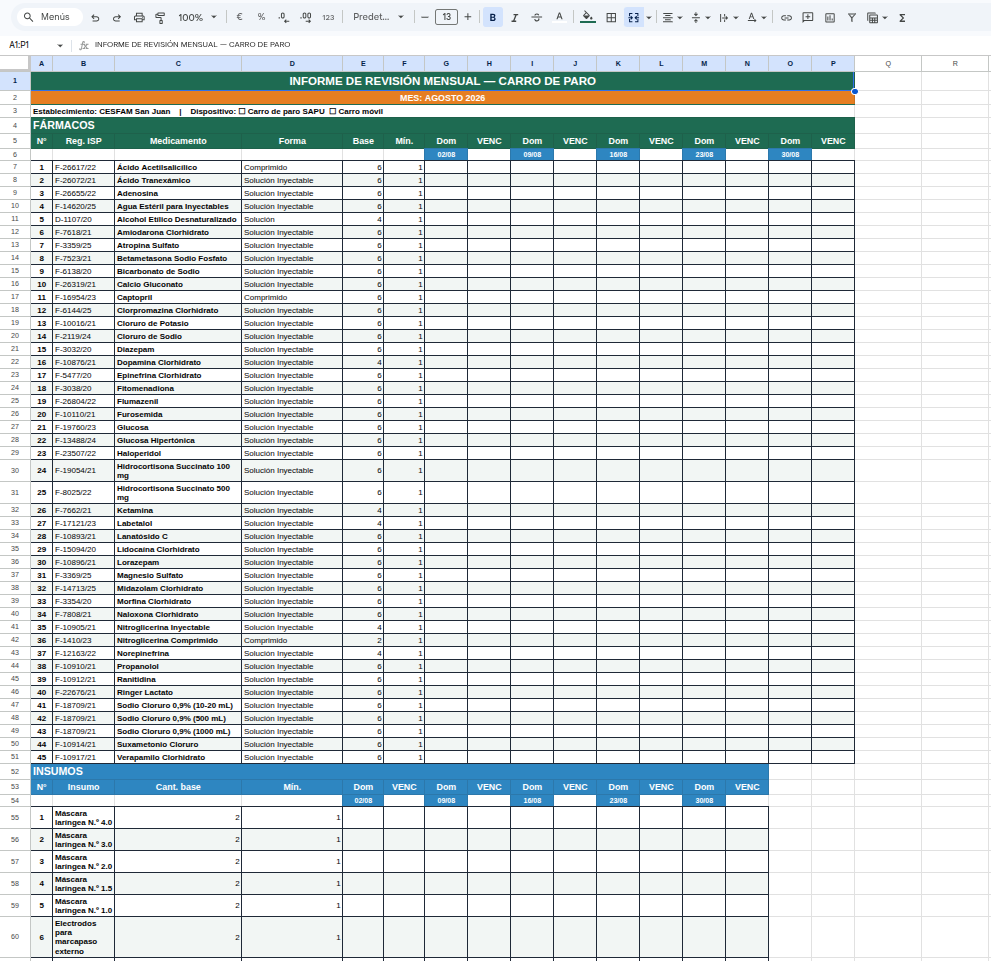
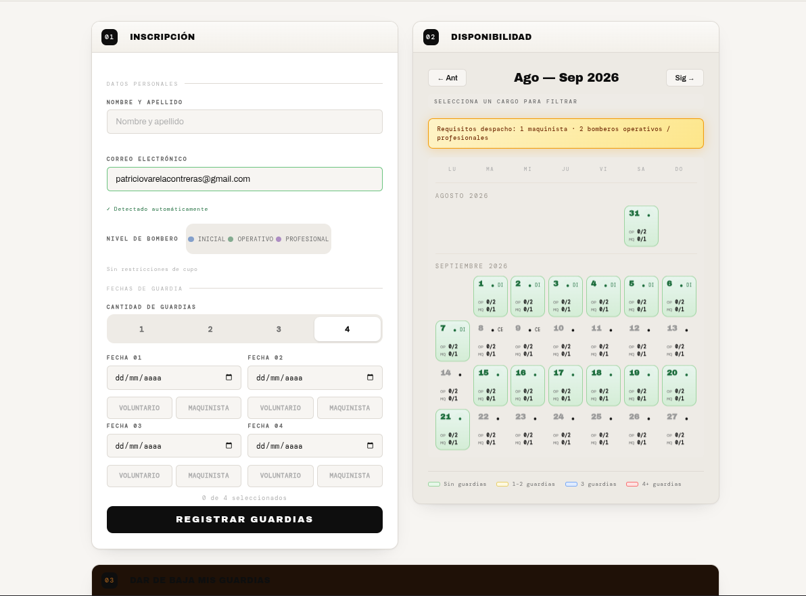
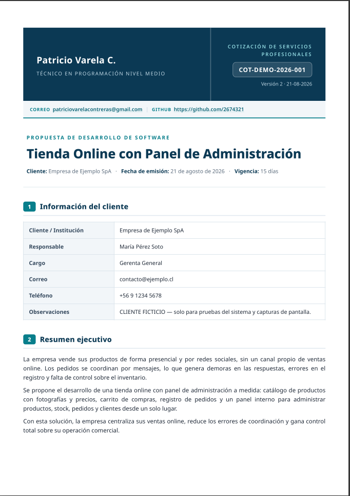

# Patricio Varela C.

**Coquimbo, Chile 🇨🇱**  
**CA2OPX** · **Bombero Operativo** · **Operador RPAS** · **Voluntario Mayor, Defensa Civil**

Desarrollo soluciones digitales orientadas a **salud pública, emergencias, gestión institucional y operaciones de terreno**. Me interesa convertir procesos que normalmente dependen de planillas, registros manuales o tareas repetitivas en sistemas simples, trazables y mantenibles.

## Tecnologías y enfoque

- **Google Apps Script + Google Sheets** para sistemas administrativos y operativos integrados con Workspace.
- **JavaScript / TypeScript / React** para aplicaciones web y PWA orientadas a uso real.
- **Python + SQLite** para sistemas locales, migraciones, ETL, validación y herramientas de soporte.
- **Ruby + GTK3** para aplicaciones de escritorio y utilidades especializadas.
- **Pruebas, auditoría y trazabilidad** como parte del desarrollo, no como una etapa posterior.
- **Offline-first, respaldos y validación de datos** cuando el contexto operativo lo requiere.

## Proyectos destacados

<table>
<tr>
<td align="center" width="50%">

 <b>ECICEP / PADI</b> · Gestión y seguimiento clínico
</td>
<td align="center" width="50%">

 <b>Carro de Paro</b> · Inventario y vencimientos
</td>
</tr>
<tr>
<td align="center" width="50%">

 <b>Sistema de Guardias</b> · Calendarización operativa
</td>
<td align="center" width="50%">

 <b>Sistema de Cotizaciones</b> · Documentos PDF verificables
</td>
</tr>
</table>

## Repositorios por área

### Salud y gestión clínica
- [**Sistema-Gestion-Sectores-ECICEP**](https://github.com/2674321/Sistema-Gestion-Sectores-ECICEP) — registro, sectorización, seguimiento y estadísticas para gestión clínica.
- [**cesfam-san-juan-padds**](https://github.com/2674321/cesfam-san-juan-padds) — seguimiento de pacientes, controles, vigencias y agenda PADI.
- [**carro-de-paro**](https://github.com/2674321/carro-de-paro) — revisión de stock, vencimientos e inventario de carros de paro y móviles.
- [**pagina-web-aurea-salud**](https://github.com/2674321/pagina-web-aurea-salud) — prototipo formativo de plataforma de salud y telemedicina.

### Emergencias, instituciones y terreno
- [**sistema-de-guardias**](https://github.com/2674321/sistema-de-guardias) — calendarización y gestión de guardias para Bomberos.
- [**base-datos-defensa-civil**](https://github.com/2674321/base-datos-defensa-civil) — gestión de voluntarios, eventos, entregas e inventario.
- [**asistencia-digital-bomberos**](https://github.com/2674321/asistencia-digital-bomberos) — PWA histórica de registro de asistencia.
- [**guia-radiocomunicaciones-ca2opx**](https://github.com/2674321/guia-radiocomunicaciones-ca2opx) — guía de códigos y procedimientos de radiocomunicación.
- [**vantops-chile**](https://github.com/2674321/vantops-chile) — planificación y bitácora PWA para operaciones RPAS.

### Gestión, escritorio y herramientas
- [**sistema-cotizaciones**](https://github.com/2674321/sistema-cotizaciones) — generación de cotizaciones PDF con verificación.
- [**generador-etiquetas-pernostock**](https://github.com/2674321/generador-etiquetas-pernostock) — generación de etiquetas Code128/QR desde planillas y CSV.
- [**seguimiento-baterias-pernostock-ltda**](https://github.com/2674321/seguimiento-baterias-pernostock-ltda) — aplicación de escritorio Ruby/GTK3 + SQLite.
- [**pagina-web-pernostock**](https://github.com/2674321/pagina-web-pernostock) — primer proyecto web, conservado como referencia histórica.
- [**github-repository-auditor**](https://github.com/2674321/github-repository-auditor) — auditor CLI de repositorios GitHub.

## Cómo trabajo

Busco que cada sistema tenga una estructura entendible, controles de integridad y una experiencia simple para la persona que realmente lo utiliza. Según el proyecto, trabajo con:

- separación entre datos, lógica y presentación;
- validaciones y mensajes de error comprensibles;
- bitácoras y trazabilidad;
- pruebas automatizadas y verificaciones de regresión;
- respaldos y recuperación;
- documentación de instalación, operación y mantenimiento;
- interfaces sobrias orientadas a tareas concretas.

El catálogo histórico y la convención local de proyectos se mantienen en [PROJECT_CATALOG.md](PROJECT_CATALOG.md).

## Contacto

**CA2OPX** · Coquimbo, Chile 🇨🇱  
**ORCID:** [0009-0002-1087-9445](https://orcid.org/0009-0002-1087-9445)
